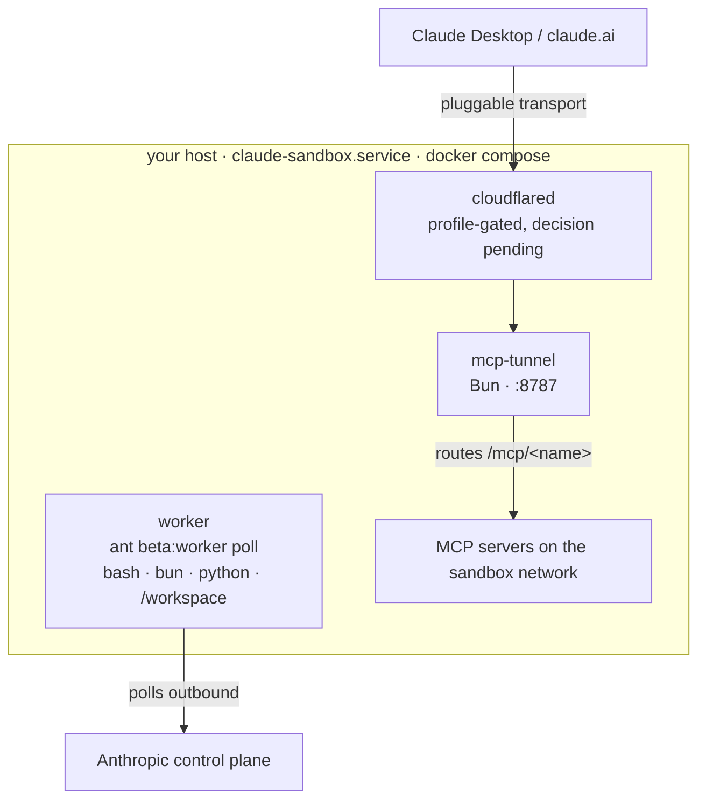
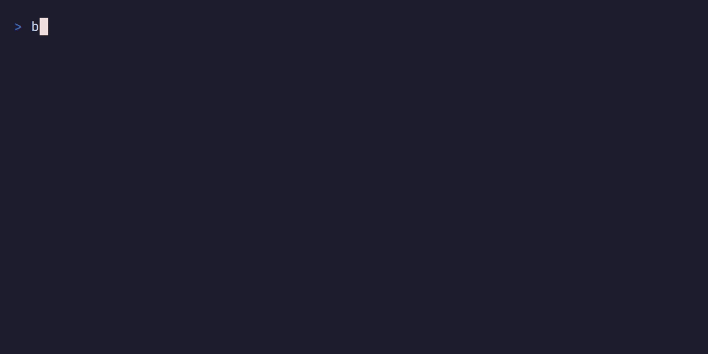

# systemd-claude-sandbox

A repeatable, self-hosted code-execution sandbox for Claude, built as a docker compose stack and supervised by systemd on any Linux host you control. The stack implements Anthropic's self-hosted sandbox contract for Claude Managed Agents, in which Anthropic enqueues sessions and a worker on your host polls the queue, claims work, and executes tool calls locally. A companion component, `mcp-tunnel`, exposes MCP servers running inside the sandbox network to remote clients such as Claude Desktop and claude.ai.

> [!NOTE]
> Full documentation lives in the Starlight site under [`site/`](site/), organized as a tutorial, how-to guides, reference, and explanation. Once published, it deploys automatically to [danielbodnar.github.io/systemd-claude-sandbox](https://danielbodnar.github.io/systemd-claude-sandbox/) on every push to main; run it locally with `just docs-dev`. This README is the short version; the site is the deep dive.

## The contract this implements

The authoritative reference is the Managed Agents self-hosted sandboxes guide (platform.claude.com/docs/en/managed-agents/self-hosted-sandboxes). The essentials the stack is built around:

The `self_hosted` environment is a work queue, not a push API. The `ant` CLI worker (`ant beta:worker poll`) claims sessions using an environment key (`ANTHROPIC_ENVIRONMENT_KEY`), which is the only credential that belongs on the worker host. The organization API key must stay off this host, because agent tool calls can read the worker's environment.

The sandbox itself must be a Linux root filesystem with `/bin/bash` at that exact path and `/workspace` as the working directory for tool execution and skill downloads. The upstream guide's recommended isolation pattern is a container image with `ant` installed and `ant beta:worker run` as the entrypoint, spawned once per claimed session. `sandbox/Dockerfile` follows that pattern verbatim and adds Bun, Python, and Git as session runtimes.

MCP servers that should stay private are not exposed to Anthropic's MCP connector at all. Either the worker wraps them as custom tools (no inbound connectivity required), or, for interactive clients like Claude Desktop, `mcp-tunnel` publishes their Streamable HTTP endpoints outbound through a pluggable transport.

## Architecture



`compose.yaml` is the repeatable unit. The `worker` service runs the always-on poller. For stronger isolation, `sandbox/spawn.sh` implements the upstream spawn-per-session pattern: the poller runs on the host with `--on-work`, and every claimed session gets a fresh `docker run --rm` container and its own output directory.

systemd's role is deliberately small. `host/systemd/claude-sandbox.service` brings the compose stack up at boot and supervises it. Container resource bounds live in `compose.yaml`, because containers run under the container engine's cgroup tree rather than under the unit that launched the compose client.

`mcp-tunnel` is a single Bun process with no build step. It validates its JSONC config with Zod, multiplexes any number of upstream MCP servers under `/mcp/<name>` on one listener, and passes Streamable HTTP through unmodified for both the 2026-07-28 and 2025-11-25 protocol revisions. Publish transports are plain async functions behind a common type; only the cloudflared adapter is implemented, and it is double-gated (config setting plus `--enable-cloudflared` flag) until the transport decision is accepted.

## Repository layout

| Path                    | Purpose                                                                                  |
| ----------------------- | ---------------------------------------------------------------------------------------- |
| `compose.yaml`          | The stack: worker, mcp-tunnel, profile-gated cloudflared                                 |
| `sandbox/`              | Worker image (Dockerfile) and spawn-per-session script                                   |
| `mcp-tunnel/`           | Bun and strict TypeScript MCP reverse proxy with pluggable publish transports            |
| `host/systemd/`         | The one unit that supervises the stack on the deploy host                                |
| `scripts/deploy.sh`     | Host-side installer, invoked by `just deploy`                                            |
| `examples/tunnel.jsonc` | Tunnel route configuration                                                               |
| `backends/cloudflare/`  | Alternative execution backend on Cloudflare Sandboxes (same contract, different runtime) |
| `docs/`                 | Architecture notes and decision records                                                  |
| `justfile`              | The repeatable workflow: build, run, test, deploy, publish                               |

## Quick start

The fastest path on any machine is the launcher script, which clones the repository if needed, probes the host for git, bun, docker or podman, compose, just, the devcontainers CLI, VS Code, and WSL, prints its decision trail, and picks the best launch mode: the compose stack when a compose-capable engine exists, the devcontainer when only Docker plus tooling exists, bare-metal bun development as the floor, and on native Windows the WSL path first, with an interactive menu instead of a failure when nothing fits. It never starts the devcontainer without Docker, delegates the actual work to the justfile, and is safe to re-run over an existing clone. From PowerShell, invoke it through WSL or Git Bash as the header explains; force a mode with `CLAUDE_SANDBOX_MODE=compose|devcontainer|bare|wsl`.

```sh
bash install.sh
```



Manual local bring-up:

```sh
cp .env.example .env      # fill in ANTHROPIC_ENVIRONMENT_KEY and _ID
just build
just up
just logs
```

Tunnel development:

```sh
just install
just typecheck
just test
just tunnel-dev
```

### Lifecycle scripts

The repository is also a Bun workspace (`mcp-tunnel`, `site`, `backends/cloudflare`), and the root `package.json` exposes the workflow as npm-ecosystem lifecycle scripts. The justfile remains the source of truth; the scripts are thin wrappers that delegate to it or to per-workspace scripts through `bun run --filter`.

```sh
bun install              # one root lockfile for all three workspaces
bun run build            # tunnel typecheck + tests, backend typecheck, site build
bun run test             # tunnel test suite
bun run typecheck        # tunnel and Cloudflare backend
bun run docs:dev         # Starlight dev server
bun run deploy -- host=MY-SERVER   # passes through to just deploy
```

Arguments after `--` pass through to the underlying just recipe, which is how `deploy` receives its host.

## Devcontainer

The repository ships a Claude Code devcontainer adapted from the reference one in anthropics/claude-code, wired into the existing compose stack instead of a standalone build. `.devcontainer/devcontainer.json` points `dockerComposeFile` at `compose.yaml` and uses the `dev` service, which builds the `dev` stage of `sandbox/Dockerfile`. That keeps a single image lineage: the dev stage layers Claude Code (native installer), zsh, git-delta, gh, and the upstream network firewall onto the same base the worker uses.

Docker-in-docker comes from the `ghcr.io/devcontainers/features/docker-in-docker:3` feature, so the full compose stack can be built and run from inside the devcontainer. Be aware of what that costs: the feature requires privileged operation, and with a compose-based devcontainer that flag must sit on the `dev` service itself, alongside the NET_ADMIN and NET_RAW capabilities the firewall script needs. The dev service is therefore a privileged container. It is confined to the `dev` compose profile so it never starts with the sandbox stack, and its shape must not be copied to services that execute untrusted code.

The firewall script is the upstream `init-firewall.sh`, vendored unmodified: default-deny egress with an allowlist of GitHub, npm, and Anthropic endpoints, applied at container start via `postStartCommand`.

```sh
just devcontainer-config   # parse and print the resolved configuration
just devcontainer-up       # build and start (bunx @devcontainers/cli)
just devcontainer-shell    # zsh inside the container
```

VS Code and other devcontainer-aware editors pick up `.devcontainer/devcontainer.json` directly.

### Coding agents in the dev image

The dev stage is a multi-agent execution environment. Five agents are installed, each by its upstream-documented method, pinned in `sandbox/Dockerfile` build args, and all requiring account sign-in as a run-later step.

| Agent       | Entry point   | Install source                                            | Auth                                                                |
| ----------- | ------------- | --------------------------------------------------------- | ------------------------------------------------------------------- |
| Claude Code | `claude`      | Native installer (claude.ai/install.sh)                   | `claude` then `/login`, or `ANTHROPIC_API_KEY`                      |
| jcode       | `jcode`       | Pinned GitHub release binary (v0.64.2), checksum-verified | Provider keys per jcode.sh/docs                                     |
| opencode    | `opencode`    | npm `opencode-ai@1.18.11` (sst/opencode)                  | `opencode auth login` (75+ providers)                               |
| OpenChamber | `openchamber` | npm `@openchamber/web@1.17.2`                             | Wraps the local opencode install; web UI guarded by `--ui-password` |
| Copilot CLI | `copilot`     | npm `@github/copilot@1.0.77`                              | `/login` in the CLI, or `GH_TOKEN`                                  |

Two clarifications from resolving the upstreams. OpenChamber is not a standalone agent: it is the community desktop and web interface for opencode, so it is installed as opencode's companion and needs Node 22, which the dev stage provides via nodesource for it and the Copilot CLI. And the Copilot CLI here is the standalone `@github/copilot` npm package, not the older `gh` extension.

A trust note, stated plainly: jcode (MIT, 1jehuang/jcode) and OpenChamber (MIT, openchamber/openchamber) are young community projects that have not been reviewed the way the Anthropic, sst, and GitHub tooling has, and this dev image is privileged for docker-in-docker. The jcode binary is checksum-pinned and every version bump is a deliberate edit, but running unreviewed agents in a privileged container is a real trade-off; keep them out of the base sandbox image (they are dev-stage only) and prefer the firewall-enabled workflow when exercising them.

## Deployment to a self-hosted server

The remote workflow targets any Linux host reachable over SSH that runs systemd and Docker with the compose plugin. Recipes take the host as an argument, so any alias or `user@host` from your SSH config works and the justfile carries no host data. Deployment is a manual step:

```sh
just deploy host=my-server        # rsync stack, build images, install the unit
just remote-up host=my-server     # systemctl start claude-sandbox.service
just remote-status host=my-server
```

The installer stages the stack in `/opt/claude-sandbox`, seeds `/opt/claude-sandbox/.env` from the example if absent, and installs the systemd unit. Fill in the environment key on the host before starting.

## Alternative backend: Cloudflare Sandboxes

`backends/cloudflare/` implements the same execution contract on Cloudflare's Sandbox SDK (GA since April 2026): sessions become `Sandbox` Durable Object instances, the container image re-applies the same provisioning (ant CLI, Bun) on Cloudflare's base image, the same `ant beta:worker poll` can run inside a sandbox, and in-sandbox MCP servers are exposed through the SDK's native cloudflared tunnels instead of mcp-tunnel. The Worker typechecks today; everything requiring an authenticated wrangler (secrets, dev, deploy) is documented in `backends/cloudflare/README.md` as run-later steps, in the same spirit as the SSH deploy.

## Documentation, tours, and tapes

Three layers of documentation serve three ways of learning. The [Starlight site](site/) carries the tutorial, how-to guides, reference tables, and explanations, and builds with `just docs-build` (link validation included). The [CodeTour](https://marketplace.visualstudio.com/items?itemName=vsls-contrib.codetour) in [`.tours/architecture.tour`](.tours/architecture.tour) walks a newcomer through the code itself, file by file, inside VS Code. The [VHS](https://github.com/charmbracelet/vhs) tapes in [`.tapes/`](.tapes/) script the key flows; render them to GIFs with `just tapes`, after which the images referenced here and in the site light up:

| Tape                | Shows                                              |
| ------------------- | -------------------------------------------------- |
| `install.tape`      | The launcher's probe and decision trail            |
| `stack-up.tape`     | `just build`, `just up`, healthy services          |
| `devcontainer.tape` | Devcontainer launch and the five agents responding |
| `mcp-tunnel.tape`   | The tunnel starting and answering `/healthz`       |

## Plugin marketplace

The repository doubles as a Claude Code plugin marketplace. `.claude-plugin/marketplace.json` declares the `systemd-claude-sandbox` marketplace (currently empty; project plugins land under `plugins/`), and `.claude/settings.json` registers three upstream marketplaces at project scope through `extraKnownMarketplaces`: `claude-plugins-official` (anthropics/claude-plugins-official), `claude-code-plugins` (anthropics/claude-code), and `knowledge-work-plugins` (anthropics/knowledge-work-plugins). Anyone who trusts this project folder in Claude Code is prompted to install these sources automatically. The manifest is checked with `claude plugin validate .`; the only current warning is the intentionally empty plugin list.

## Publishing to GitHub

The repository is created and pushed once with:

```sh
just publish
```

The recipe creates the private repository if it is missing, pushes main, and enables GitHub Pages with the Actions source through the API. The docs workflow (`.github/workflows/docs.yml`) then builds `site/` with Bun and deploys it on every push to main. If the Pages API call fails, flip it manually once: Settings, then Pages, then Source: GitHub Actions.

## Open decision: tunnel publish transport

How `mcp-tunnel` becomes reachable from outside the deploy host is proposed but not confirmed. Cloudflare Tunnel is the proposed default, with WireGuard and plain SSH forwarding as alternatives. The interfaces in `mcp-tunnel/src/transport/` are final and the cloudflared path is scaffolded behind a flag and a compose profile. See `docs/decisions/0001-tunnel-transport.md` and do not implement further until it is accepted.

## Versions verified against

Verified on 2026-08-01: Anthropic `ant` CLI 1.21.0 with the `managed-agents-2026-04-01` beta, MCP spec revision 2026-07-28, Bun 1.3.14, and the docker compose v2 plugin. A note on the repository name: the earlier iteration of this project built a vmspawn VM image with mkosi, and the systemd-first naming survives from that design. The compose runtime replaced it; the tension is recorded in `docs/architecture.md`.
